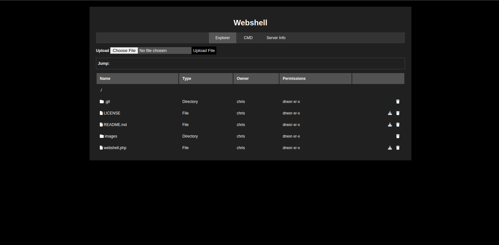

# WebShell

This is a simple minimal webshell developed in PHP that allows you to explore the files and directories of a web server from your browser and execute commands.

## Features

- Navigate through server directories.
- View the list of files and directories in each directory.
- Display whether an item is a directory or a file.
- Show the content of text files when clicked on.
- Execute commands

## Usage

1. Clone this repository to your web server.
2. Access the file browser in your web browser.
3. Navigate through directories by clicking on them.
4. Click on files to view their content (if they are text files).

## Technologies Used

- PHP
- HTML
- CSS

## Contributing

If you want to contribute to the development of this file browser, feel free to do so! You can fork the repository, make your changes, and submit a pull request.

## License

This project is licensed under the MIT License. See the [LICENSE](LICENSE) file for more details.
